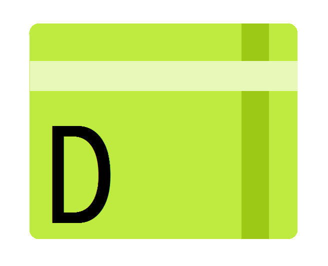

<p align="center">
  
</p>
<h1 align = "center">Welcome to the <b>D++</b> Wiki</h1>
<h3 align = "center">
  The Simplest Multi-purpose Programming Language
</h3>

## Introduction
:zap: ¤ D++ is a simple scripting language written in Pawn. It is made purely for fun and with an intention to learn more about Pawn itself, thus D++ should not be taken as a serious language. However, the language itself is still impressive considering it is written in Pawn.

- For the impatient, here is the example code:
```pawn
import::package.console;
import::package.system;

using::system.rem,"Basic println example.";
using::console.println,"Hello World";
```

- Code output:

```
[19:19:44] [Info] |======================================|
[19:19:44] [Info]                                         
[19:19:44] [Info]                    D++                  
[19:19:44] [Info]          Interpreter is loading...      
[19:19:44] [Info]                                         
[19:19:44] [Info]         Version: 3.0.0-R1          
[19:19:44] [Info]                                         
[19:19:44] [Info]                By: DEntisT              
[19:19:44] [Info]                                         
[19:19:44] [Info] |======================================|
[19:19:44] [Info]                                         
[19:19:44] [Info]                                         
[19:19:44] [Info] >> D++ | INFO: Debug component loaded...
[19:19:44] [Info] >> D++ | INFO: Executing the entry script...
[19:19:44] [Info]                                                
[19:19:44] [Info] |====================| index.dpp |====================|
[19:19:44] [Info] 
[19:19:44] [Info] Hello World
[19:19:44] [Info]                                                
[19:19:44] [Info] |==============================================|
[19:19:44] [Info]                                                
[19:19:44] [Info] >> D++ | INFO: The interpreter reached the EOS point.
```
## Documentation

### The language

- [Interpreter options](doc/dpp_options.md)
- [Interpreter components](doc/dpp_components.md)
- [Modules](doc/dpp_modules.md)
- [Constants](doc/dpp_const.md)
- [Variables](doc/dpp_vars.md)
- [Forms and types of forms](doc/dpp_forms.md)
- [If-expressions](doc/dpp_if.md)
- [Instructions](doc/dpp_instruct.md)
- [Classes](doc/dpp_class.md)
- [Miscellaneous](doc/dpp_misc.md)

### Other info

- Examples - [see here](doc/dpp_example.md).


### Worried about the latest updates?

Just regularly check the [workflow runs](https://github.com/samp-api/dpp/actions)! Always select the latest **successful** workflow to download the latest build artifacts from.